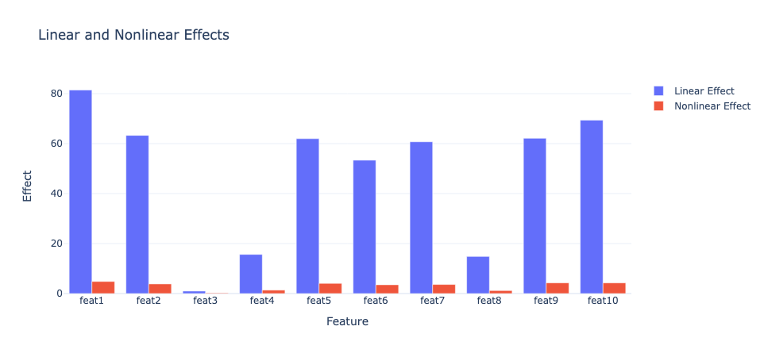
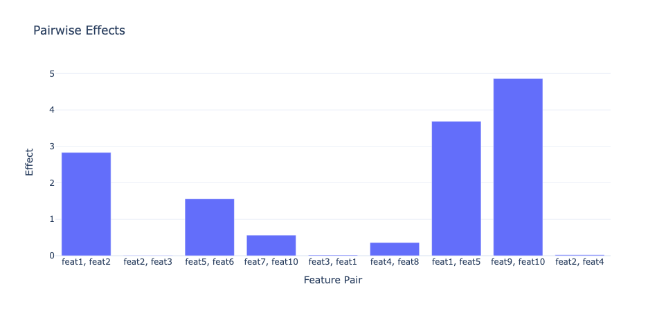

# Model Fingerprint

## Introduction
A model-agnostic method to decompose predictions into linear, nonlinear and pairwise interaction effects. It can be helpful in feature selection and model interpretation.

The algorithm is based on paper [Beyond the Black Box: An Intuitive Approach to Investment Prediction with Machine Learning](https://www.pm-research.com/content/iijjfds/2/1/61). The following figures are the output.

There are 3 major **benefits** of model fingerprint algorithm:

- Model fingerprint is a **model-agnostic** method, which could be applied on top of any machine learning models. 
- The resulting decompositions of effects are highly **intuitive**. We can easily understand which feature has greater influence compared to others, and in what form (linear, nonlinear and interactions). 
- The **units** of all three effects are common, which is also the same as the unit of response variable that is predicted. This makes it even more intuitive.

## Partial Dependence Function

The model fingerprint algorithm extends the partial dependence function. 

### Calculation of Partial Dependence Function
The partial dependence function assesses the marginal effect of a feature by following these steps:

1. Changing the value of the selected feature across its full range (or a representative set of values).
2. For each value of the selected feature, the model predicts outcomes for all instances in the dataset. Here, the varied feature is assumed to be the same for every instance, while other features are kept at their original values.
3. The average of these predictions gives us the partial dependence for a value of the chosen feature.

This partial dependence can be understood as the expected prediction of the model as a function of the feature of interest. The same process will be performed for all features.

### Two Remarks on Partial Dependence Function

1. The partial dependence function will vary little if the selected feature has little influence on the prediction. 
2. If the influence of a certain feature on the prediction is purly linear, then its partial dependence plot will be a straight line. For example, for ordinal regression model, the partial dependence plots for all features will be a straight line whose slope equals to the coefficient.

## Decompostion of Predictions

The model fingerprint algorithm decomponse the partial dependence function of a certain feature into a linear part and a nonlinear part. It fits a linear regression model for the partial dependence function. We denote the fitted regression line as $l_k$ and partial dependence function as $f_k$ for feature $k$. 

### Linear Effect
The linear prediction effect of a feature is defined by the mean absolute deviation of the linear predicitons around their average value:

$$\text{Linear Effect of } x_k = \frac{1}{N} \sum_{i=1}^{N}abs(l_{k}(x_{k, i}) - \frac{1}{N}\sum_{j=1}^{N}f_k (x_{k, j}))$$

### Nonlinear Effect

The nonlinear prediction effect is defined by the mean absolute deviation of the total marginal effect around its corresponding linear effect:

$$\text{Nonlinear Effect of } x_k = \frac{1}{N} \sum_{i=1}^{N}abs(f_k(x_{k, i}) - l_k (x_{k, j}))$$

Here is a plot demonstrating the partial dependence function, fitted regression line, linear component, and nonlinear component.

.jpg)*(Li, Y., Turkington, D. and Yazdani, A., 2020)*

### Pairwise Interaction Effect

The calculation of pairwise interaction prediction effects is similar but this time a joint partial dependence function for both features are calculated, denoted as $f_{k, l}$. Following a similar line of thought of H-statistics, the pairwise interaction effect is defined by the de-meaned joint partial prediction minus the individual de-meanded partial predictions:

$$\text{Pairwise Interaction Effect of } (x_k, x_l) = \frac{1}{N^2} \sum^{N}_{i=1}\sum^{N}_{j=1} abs(f_{k, l} (x_{k, i}, x_{l, j}) - f_k (x_{k, i}) - f_l (x_{l, j}) )$$

## Drawback

- The pairwise combinations of features need to be manually assigned and too many combinations can lead to slow computation.
- Higher order interactions between features are not demonstrated.
- The sign (direction) of feature influence is not shown.

## Further TODO
- [ ] compatibility with classifier
